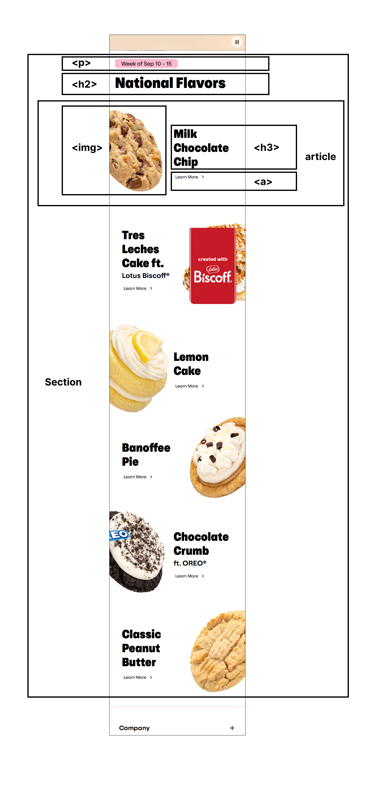

## Jij

### Auteur:

Kelly Neutel

#### Je startniveau:

Blauw

#### Je focus:

Responsive plane

## Je website: Crumbl

### Je opdracht:

https://crumblcookies.com/

#### Screenshot(s) van de eerste pagina (small screen):

Crumbl homepage  
 

#### Screenshot(s) van de tweede pagina (small screen):

Crumbl detailspagina

## Toegankelijkheidstest 1/2 (week 1)

### Bevindingen

- screenreader leest alle headers voor en dat word irritant en verwarrend
- voor iemand die niet gewoon is om een screanreader te gebruiken is het moeilijk om te gebruiken
- je zou denken dat beroemde merken, websites hebben zonder foutmeldingen maar de mijne had er wel een aantal

## Breakdownschets (week 1)

### de hele pagina:

  

### Kleinere deel:

  
   

### dynamisch deel (bijv menu):

  

## Voortgang 1 (week 2)

  
uitwerken voor 1e voortgang

### Stand van zaken

Het begin was een beetje lastig, omdat ik moest uitzoeken waar ik het beste mee kon beginnen. Na wat werk besloot ik helemaal opnieuw te starten, omdat mijn code niet duidelijk genoeg was en het scherm er niet zo uitzag als ik wilde. Ik merkte ook dat ik per ongeluk voor een desktopgrootte bezig was, terwijl ik eigenlijk voor mobiel moest beginnen. Dus heb ik een nieuw document geopend en ben ik weer opnieuw begonnen. Ook was hte een beetje moeilijk on de breakdown schets te maken omdat ik nog niet precies wist welke elements er nodig zijn op de websites.

 

### Verslag van meeting

- Ik moet me eerst concentreren op alle content erin te stoppen
- Het moet niet exact eruit zien zoals de echte.

## Voortgang 2 (week 3)

### Stand van zaken

Ik heb deze week meer vooruitgang gemaakt na alle content in de html te plaatsen en proberen om zo mooi mogelijk te plaatsen zodat het ook mooi is.

Ik ben ook gaan werken aan states dus hover, focus, active bij alle nodige knoppen en dat verliep heel vlot.

### Verslag van meeting

hier na afloop snel de uitkomsten van de meeting vastleggen

- Ik kreeg de tip om echt de video in mijn website te zetten en kreeg een website link daarvoor
- ik moet voortgdang maken en beginnen werken aan mijn 2de scherm

## Toegankelijkheidstest 2/2 (week 4)

### Bevindingen

- content is allemaal goed
- bij de global code heb ik een waarning maar voor de rest is het goed en dat is beter dan de echten want die heeft errors
- de focus states die ik heb zijn goed maar ik moet het nog aanvullen
- Mobile en touch is allemaal goed en mijn website ziet er goed uit op mobile
- de headings zijn vooral goed ik moet gewoon zien wat goede headings zijn voor de footer.
- mijn video autoplays maar je kan erop klikken om te pauzeren
- de controls werken goed maar moet aangevuld worden
- ik heb geen dark en light mode en high-contrast mode
- media query is goed
- kleuren hebben goede contrast zoals op de echte website

## Voortgang 3 (week 4)

### Stand van zaken

Ik heb veel voortgang gemaakt ik heb de tweede pagina ondertussen ook aangemaakt en alle content erin gestopt en gestyled.

ik ben ook hard aan het werk gegaan met de media queries en ervoor gezorgd dat alles ook mooi geplaatst en groot genoeg is op desktop versie

Ik heb ook al geprobeerd om mijn menu burger bar te maken maar dat is wat moeilijk aan het gaan dus bne daar volop mee bezig

### Verslag van meeting

hier na afloop snel de uitkomsten van de meeting vastleggen

- Ik geb een link gekregn voor burgerbar in javascript
- ik moet alle buttons van beide paginas met elkaar verbinden en dus <a> gebruiken ipv button
- ik kan gewoon \*:focus gebruiken om alle focus states samen te veranderen en het hoeft niet individueel per knop

## Eindgesprek (week 5)

  
uitwerken voor eindgesprek

### Je uitkomst - karakteristiek screenshots:

  

### Dit ging goed/Heb ik geleerd:

Korte omschrijving met plaatjes

  

### Dit was lastig/Is niet gelukt:

Korte omschrijving met plaatjes

  

## Bronnenlijst

1. [burger menu icon voor in html](https://www.codetable.net/decimal/9776) eerst gevraagd aan chatgpt hoe
2. [uitleg over hoe video te embedden in html](https://developer.mozilla.org/en-US/docs/Web/HTML/Element/video)
3. [uitleg over hoe media queries werken en hoe te gebruiken](https://developer.mozilla.org/en-US/docs/Web/CSS/CSS_media_queries/Using_media_queries)
4. [X icon om menu uit te kunnen doen](https://toolstud.io/web/charmap.php?encoded=times&utm_content=cmp-true)
5. [tabindex om ook p en headings ene focus state te geven voor als gebruirken wil tabben en weten waar hij is](https://developer.mozilla.org/en-US/docs/Web/HTML/Global_attributes/tabindex)
6. [Social media icons open in new window](<https://html.com/attributes/a-target/#:~:text=browser%20specifies%20otherwise.-,a%20target%3D%E2%80%9D_blank%E2%80%9D%20Open%20in%20New%20Browser%20Tab%20(,oder%20browsers)%20a%20new%20window.>)
7. [Box shadow om duidelijke verschil te geven tussen nav bar en rest van pagina](https://developer.mozilla.org/en-US/docs/Web/CSS/box-shadow)
8. [transition voor menu bar wanneer hij schuift](https://www.w3schools.com/css/css3_transitions.asp)
9. [aria expanded 1 voor menu bar](https://developer.mozilla.org/en-US/docs/Web/Accessibility/ARIA/Attributes/aria-expanded)
10. [aria expanded 2 voor menu bar](https://www.a11y-collective.com/blog/aria-expanded/)
11. [transform scale voor de cookies om wat beweging te geven bij hover](https://developer.mozilla.org/en-US/docs/Web/CSS/transform-function/scale)
12. [grid column voor verschil van look in desktop versie op de tweede pagina in media querie](https://developer.mozilla.org/en-US/docs/Web/CSS/grid-column)
13. BingAi gebruikt om links te geven van websites met uitleg over vraag.
14. ChatGpT als ik echt vast zat in iets in verband met de class/id selectors niet mocht gebruiken.
15. Chatgpt help for javascript "leg uit in een beginner level hoe ik een javascript kan opmaken voor een burger menu"

